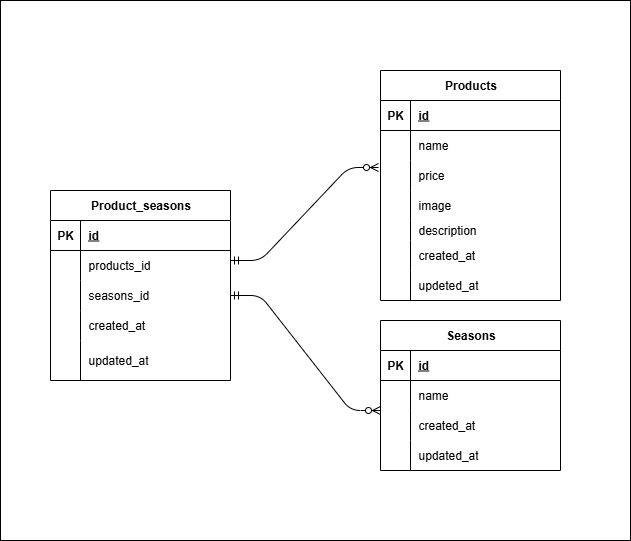

# Laravel-test-MOGITATE

## 環境構築
**Dockerビルド**
1. `git clone git@github.com:Zoe0327/MOGITATE.git`
2. DockerDesktopを起動
3. `docker-compose up -d --build`

**Laravel環境構築**
1. `docker-compose exec php bash`
2. `composer install`
3. `.env.example` を `.env` にリネーム、または新しく `.env` 作成
4. .envに以下の環境変数を追加
--text
  DB_CONNECTION=mysql
  DB_HOST=mysql
  DB_PORT=3306
  DB_DATABASE=laravel_db
  DB_USERNAME=laravel_user
  DB_PASSWORD=laravel_pass
  ※ DB_HOST は Docker Compose の MySQL サービス名に合わせて設定してください。
   デフォルトでは mysql ですが、環境によって自動生成されるコンテナ名（例：mogitate-mysql-1）になることがあります。

5. アプリケーションキーの作成
--bash
php artisan key:generate

6. マイグレーションの実行
--bash
php artisan migrate

7. シーディングの実行
--bash
php artisan db:seed

8. ストレージングの作成
php artisan storage:link

## 使用技術(実行環境)
- PHP8.1.3
- Laravel8.83.29
- MySQL8.0.26

## ER図

## URL
- 開発環境：http://localhost/products
- phpMyAdmin:：http://localhost:8080/